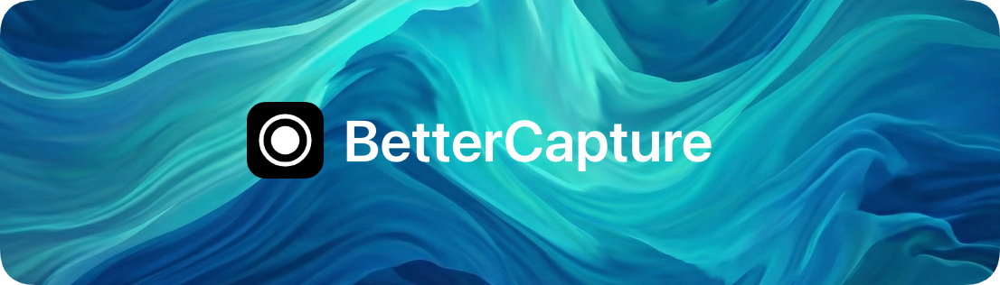
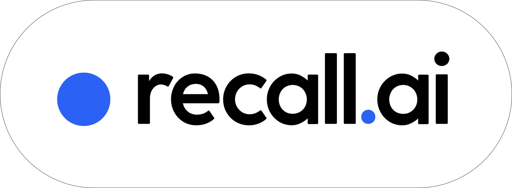

<p align="center">
  
</p>

<p align="center">
    The macOS screen recorder for the rest of us - always free and open source with a native look and feel 📺 
</p>

<p align="center">
  <a href="https://bettercapture.app">Website</a> ·
  <a href="#installation">Installation</a> ·
  <a href="#features">Features</a> ·
  <a href="#contributing">Contributing</a>
</p>

<p align="center">Sponsored by</p>

<p align="center">
  <a href="https://docs.recall.ai/docs/desktop-sdk?utm_source=github&utm_medium=sponsorship&utm_campaign=jsattler-BetterCapture">
    
  </a>
</p>

<p align="center">If you're looking for a hosted desktop recording API, consider checking out <a href="https://docs.recall.ai/docs/desktop-sdk?utm_source=github&utm_medium=sponsorship&utm_campaign=jsattler-BetterCapture">Recall.ai</a>,<br>an API that records Zoom, Google Meet, Microsoft Teams, in-person meetings, and more.</p>

## Features

- **Native macOS integration**: Built with SwiftUI and ScreenCaptureKit, lives in your menu bar
- **Professional encoding**: ProRes 422/4444, HEVC (H.265), and H.264 codecs with support for alpha channel and HDR
- **Flexible audio capture**: Record system audio and microphone simultaneously
- **Content filtering**: Exclude specific content from recordings
- **Privacy-focused**: No tracking, no analytics, all recordings stored locally
- **MIT licensed**: Free and open source

## Installation

### Homebrew

```bash
brew install jsattler/tap/bettercapture
```

### Direct Download

Download the latest release from [GitHub Releases](https://github.com/jsattler/BetterCapture/releases/latest) and open `BetterCapture.dmg`.

**Requirements**: macOS 15.2 (Sequoia) or later

## Contributing

We welcome contributions of all kinds! Please see our [Contributing Guidelines](CONTRIBUTING.md) for more details on how to get involved.

**Note**: Any issues or pull requests for feature requests submitted without prior discussion will be closed immediately.

## Acknowledgments

Special thanks to these projects for their excellent work and inspiration:

- [**QuickRecorder**](https://github.com/lihaoyun6/QuickRecorder)
- [**Azayaka**](https://github.com/Mnpn/Azayaka)

## License

This project is licensed under the MIT License - see the [LICENSE](LICENSE) file for details.
