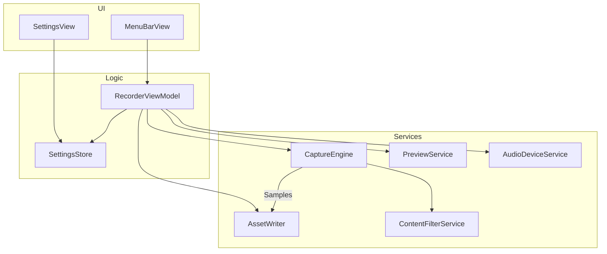

# BetterCapture Architecture

This document provides a high-level overview of the BetterCapture architecture, focusing on the component structure, data flow, and media handling.

## High-Level Components

BetterCapture follows the **MVVM (Model-View-ViewModel)** pattern. The application is structured around a central ViewModel that coordinates interactions between the UI views and various backend services.

### Component Relationship Diagram

### Key Components Description

- **RecorderViewModel**: Orchestrates the recording lifecycle and manages application state.
- **SettingsStore**: Persists user preferences and enforces codec/container compatibility logic.
- **CaptureEngine**: Manages ScreenCaptureKit streams and content selection.
- **AssetWriter**: Handles media encoding and disk I/O for captured samples.
- **PreviewService**: Provides live and static thumbnails of selected content.
- **ContentFilterService**: Implements window exclusions and system UI hiding.
- **AudioDeviceService**: Discovers and monitors available audio input devices.

## Recording Data Flow

The screen recording process involves a pipeline where data flows from the system's `ScreenCaptureKit` through the application services to the disk.

### Internal Flow Diagram

```mermaid
sequenceDiagram
    participant User
    participant ViewModel as RecorderViewModel
    participant Engine as CaptureEngine
    participant SCK as ScreenCaptureKit
    participant Writer as AssetWriter
    participant Disk as File System

    User->>ViewModel: Click "Start Recording"
    ViewModel->>Writer: Setup (File URL, Settings)
    ViewModel->>Engine: startCapture(Settings)

    rect rgb(30, 30, 30)
        note right of ViewModel: Recording Loop
        Engine->>SCK: Create & Start SCStream
        SCK-->>Engine: Output Video SampleBuffer
        Engine-->>Writer: Append Video Sample
        SCK-->>Engine: Output Audio SampleBuffer
        Engine-->>Writer: Append Audio Sample
        Writer-->>Disk: Write Media Data
    end

    User->>ViewModel: Click "Stop Recording"
    ViewModel->>Engine: stopCapture()
    Engine->>SCK: Stop Stream
    ViewModel->>Writer: finishWriting()
    Writer-->>Disk: Finalize Movie File
    ViewModel->>User: Send Notification
```

### Flow Details

1.  **Initialization**: When the user initiates a recording, the `RecorderViewModel` prepares the `AssetWriter` with the target file path and encoding settings.
2.  **Capture Start**: The `CaptureEngine` validates permissions, applies content filters (e.g., hiding the cursor or wallpaper), and initializes the `ScreenCaptureKit` stream.
3.  **Sample Processing**:
    - `ScreenCaptureKit` delivers `CMSampleBuffer` objects (video frames, system audio, microphone audio) to the `CaptureEngine`.
    - The `CaptureEngine` forwards these buffers synchronously to the `AssetWriter` via a delegate pattern.
    - The `AssetWriter` appends these samples to the `AVAssetWriterInput`s. It handles pixel format conversion (e.g., for HDR 10-bit support) if necessary.
4.  **Finalization**: Upon stopping, the stream is halted, and the `AssetWriter` closes the file, ensuring all metadata is written correctly.

## Codecs and Containers

BetterCapture supports flexible combinations of codecs and containers, managed by the `SettingsStore`. The architecture ensures that invalid combinations (like Alpha channel in MP4) are prevented at the configuration level.

### Supported Containers

- **MOV (QuickTime)**: The preferred format. Supports all features including Alpha Channel, HDR, and uncompressed audio (PCM).
- **MP4 (MPEG-4)**: A widely compatible format. Restricted to H.264/HEVC and AAC audio. Does not support Alpha Channel or HDR.

### Supported Codecs

- **Video**: H.264, HEVC (H.265), ProRes 422, ProRes 4444.
- **Audio**: AAC (Compressed), PCM (Uncompressed).

> **Note**: For detailed compatibility matrices, restrictions, and feature support (such as Alpha Channel availability per codec), please refer to the [Output Settings](OUTPUT.md).
