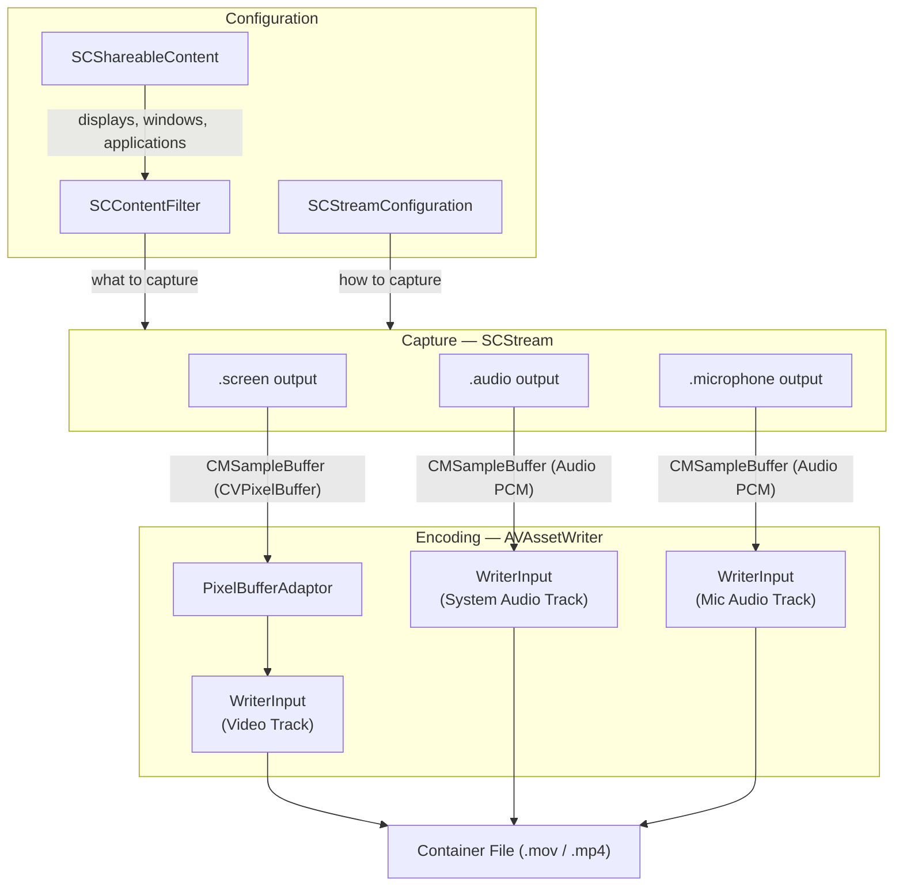

# ScreenCaptureKit Overview

How Apple's ScreenCaptureKit (SCK) and AVFoundation work together to capture screen content and write it to disk.
For background on video/audio concepts (codecs, pixel formats, HDR, etc.), see [concepts/VIDEO.md](../concepts/VIDEO.md) and [concepts/AUDIO.md](../concepts/AUDIO.md).

## Recording Pipeline

A screen recording goes through three stages: **configure** what and how to capture, **capture** the screen and audio as sample buffers, then **encode and write** those buffers to a file.

### Stage by stage

1. **Configuration:** The app queries `SCShareableContent` for available displays and windows, then builds an `SCContentFilter` (what to capture) and an `SCStreamConfiguration` (how to capture: resolution, frame rate, pixel format, audio settings).
2. **Capture:** `SCStream` takes the filter and configuration, starts capture, and delivers `CMSampleBuffer` objects through three separate output callbacks: `.screen` (video frames), `.audio` (system audio), and `.microphone` (mic audio, macOS 15+). Each callback runs on its own dispatch queue.
3. **Encoding:** Each sample buffer is forwarded to the matching `AVAssetWriterInput`. Video frames pass through an `AVAssetWriterInputPixelBufferAdaptor` for pixel format handling. The writer inputs encode the data using the configured codec (H.264, HEVC, ProRes, AAC, PCM).
4. **Output:** `AVAssetWriter` multiplexes all encoded tracks into a single container file (MOV or MP4) on disk.

All three streams share a single `CMClock` (`SCStream.synchronizationClock`) so audio and video stay in sync throughout.

## Key Classes

### ScreenCaptureKit (Capture Side)

| Class                    | Role                                                                                                                     |
| ------------------------ | ------------------------------------------------------------------------------------------------------------------------ |
| `SCShareableContent`     | Queries available displays, windows, and applications that can be captured.                                              |
| `SCContentFilter`        | Specifies _what_ to capture -- a display, a window, or an application group, with include/exclude rules.                 |
| `SCStreamConfiguration`  | Specifies _how_ to capture -- resolution, frame rate, pixel format, color space, audio settings, cursor visibility, etc. |
| `SCStream`               | The active capture session. Takes a filter and configuration, produces sample buffers via a delegate.                    |
| `SCStreamOutput`         | Protocol that receives `CMSampleBuffer` callbacks for video and audio data.                                              |
| `SCStreamDelegate`       | Protocol for lifecycle events (stream errors, stream stopped).                                                           |
| `SCContentSharingPicker` | System-provided UI for the user to select what to share (display, window, or area).                                      |

### AVFoundation (Writing Side)

| Class                                  | Role                                                                                                             |
| -------------------------------------- | ---------------------------------------------------------------------------------------------------------------- |
| `AVAssetWriter`                        | Writes encoded media data to a container file (MOV or MP4).                                                      |
| `AVAssetWriterInput`                   | Represents a single track (video, system audio, microphone audio). Receives `CMSampleBuffer` data.               |
| `AVAssetWriterInputPixelBufferAdaptor` | Optimized interface for appending `CVPixelBuffer` video frames to a writer input. Handles pixel format bridging. |

### Core Media (Shared)

| Type             | Role                                                                                                                                                           |
| ---------------- | -------------------------------------------------------------------------------------------------------------------------------------------------------------- |
| `CMSampleBuffer` | The fundamental data unit passed between SCK and AVFoundation. Carries either a video frame (`CVPixelBuffer`) or audio samples, along with timing information. |
| `CMTime`         | Precise time representation used for timestamps and durations.                                                                                                 |
| `CMClock`        | Synchronization clock shared between capture and writing to keep audio and video in sync.                                                                      |

## Stream Output Types

`SCStream` delivers sample buffers through the `SCStreamOutput` protocol with three output types:

| Type          | Description                                                                                            |
| ------------- | ------------------------------------------------------------------------------------------------------ |
| `.screen`     | Video frames as `CMSampleBuffer` containing a `CVPixelBuffer`. Delivered at the configured frame rate. |
| `.audio`      | System audio samples. Delivered as interleaved PCM buffers at the configured sample rate.              |
| `.microphone` | Microphone audio samples (macOS 15+). Same format as system audio.                                     |

## Content Filter Patterns

`SCContentFilter` supports several capture modes:

| Mode                      | What It Captures                                |
| ------------------------- | ----------------------------------------------- |
| Display (include windows) | Entire display with specified windows included  |
| Display (exclude windows) | Entire display minus specified windows          |
| Single window             | One specific window                             |
| Application group         | All windows belonging to specified applications |

Content filters can be updated on a running stream via `SCStream.updateContentFilter(_:)` without restarting capture.

## Further Reading

- [Apple ScreenCaptureKit Documentation](https://developer.apple.com/documentation/screencapturekit)
- [Apple AVFoundation Documentation](https://developer.apple.com/documentation/avfoundation)
- [WWDC 2022: Take ScreenCaptureKit to the next level](https://developer.apple.com/videos/play/wwdc2022/10155/)
- [WWDC 2023: What's new in ScreenCaptureKit](https://developer.apple.com/videos/play/wwdc2023/10136/)
- [WWDC 2024: Capture HDR with ScreenCaptureKit](https://developer.apple.com/videos/play/wwdc2024/10088/)
